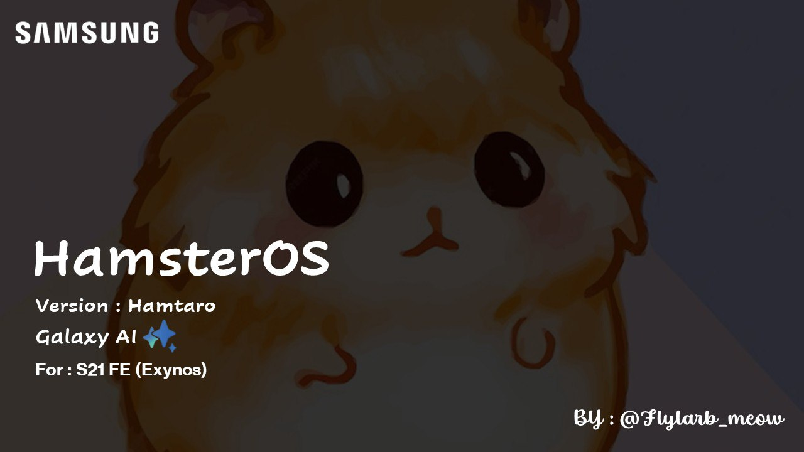

<h1 align="center">
  
</h1>

Wellcome to HamsterOS 🐹

  <a href="https://t.me/A54DEVELOPER">💬 Telegram Group</a>

# About HamsterOS
HamsterOS is a custom firmware in development for the Samsung Galaxy S21 FE device. It is based on the latest and greatest Samsung UI and also includes additional features and tweaks to ensure the best user experience.

# Additional Features
- 4K 120fps in Pro Video
- Adaptive Color Tone
- Bixby and Hi Bixby Voice wake-up
- Disabled few Samsung Security
- Show Lock screen wallpaper in AOD
- Allow secure screenshot
- Auto confirm 4 digits pin
- New about phone interface
- New boot animation (like S24)
- One UI Version shows 6.1.1
- Outdoor Mode
- Ultrasonic fingerprint animations
- Secure Folder and Health prepatched
# How Install 🐹

* **[Guide Install](https://github.com/MrDemon-LICH/Testes/blob/main/Install.md)**

* **[Changelog](https://github.com/MrDemon-LICH/Testes/blob/main/changelog.md)**

# Copyright Notice

Copyright © 2024 HamsterOS. All rights reserved.

For LICHROM all rights to the software are reserved to the owner.

The following conditions apply:

1. **No Modifications:** The software may not be modified in any way. This includes but is not limited to changing, adding, or removing any part of the software's code or functionality.

2. **No Redistribution:** The software may not be redistributed in any form. This includes but is not limited to renaming, selling, or including the software as part of another project.

3. **No Picking:** No parts, pieces, or components of the software may be extracted and submitted to other projects. This includes, but is not limited to, code snippets, functions, and released binaries.

4. **No Claim to Succession:** Any fork of the software that was created before the license change may not claim to be an official or unofficial successor to the project. This includes but is not limited to using the project's name, branding, or reputation to imply a connection to the original project.

# Credits
A big thanks goes to the following for their invaluable contributions in no particular order:
- **[salvogiangri](https://github.com/salvogiangri)** for his [UN1CA](https://github.com/salvogiangri/UN1CA/tree/main) which inspired this project, inspired this repository and for his [OnUpdater](https://github.com/Mesa-Labs-Archive/OnUpdate).
- **[GalaxyApks](https://t.me/galaxyapks)** for mods
- **[Flylarb_meow](https://t.me/Flylarb_meow)** for his help and support
- **[Winner](https://t.me/@Winnerxd1001)** for his help and support
- **[ShaDisNX255](https://github.com/ShaDisNX255)** for his help and support
- **[LineageOS Team](https://www.lineageos.org/)** for Updater-binary
- **[corsicanu](https://github.com/corsicanu)** for GoodLock Patched
- **[Vaz15k](https://github.com/Vaz15k)** for Ofox,SHRP, and Vbmeta
- **[3arthur6](https://github.com/3arthur6)** for BluetoothLibraryPatcher
- *All people for use LICHROM❤️*
